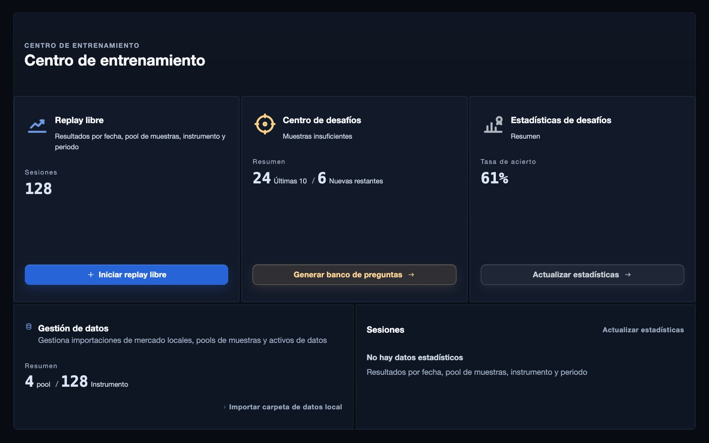
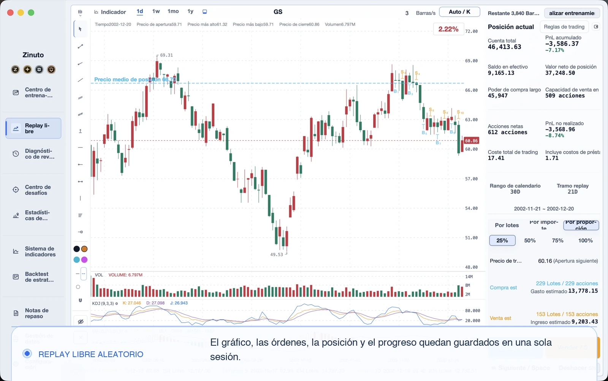
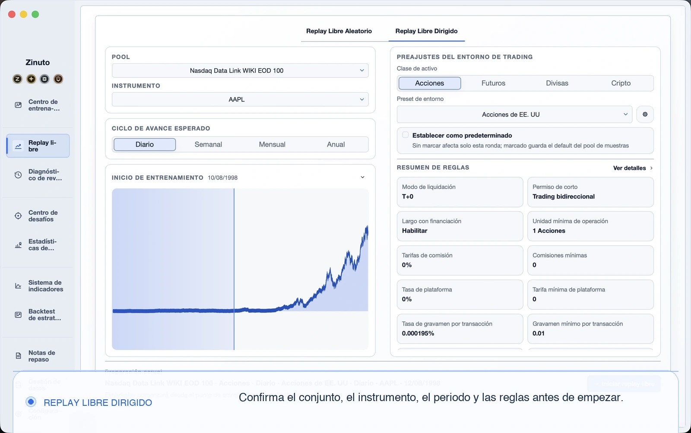
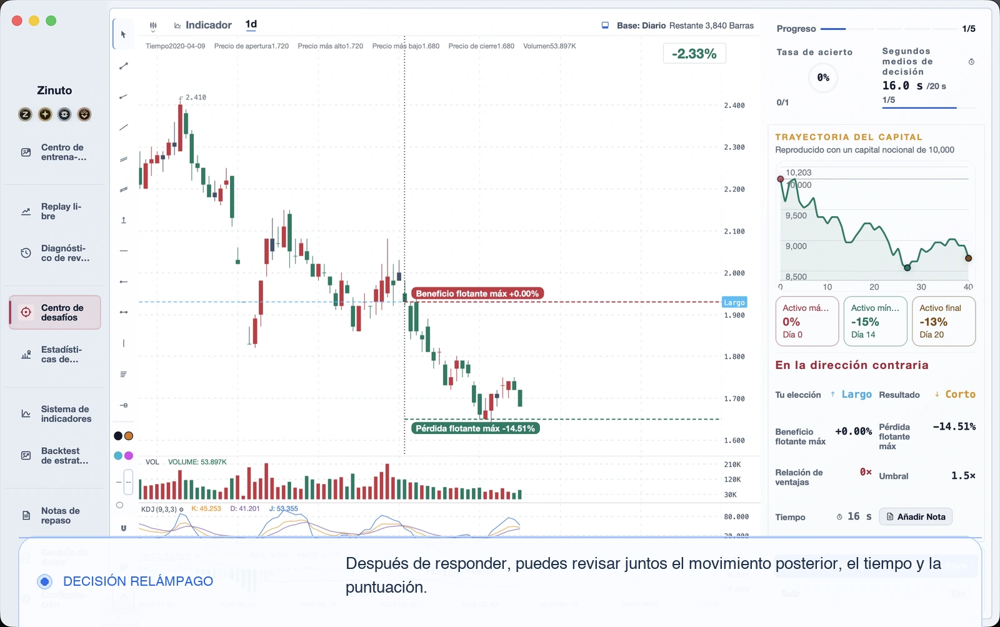
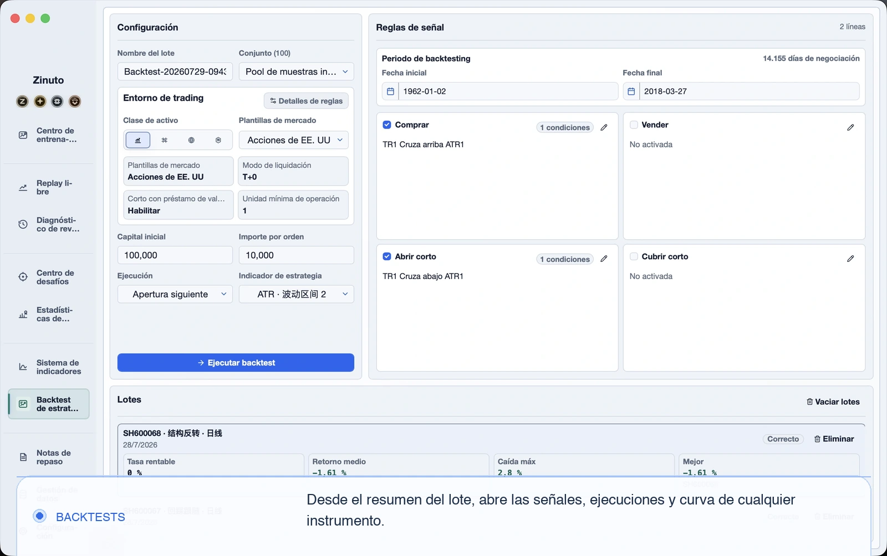
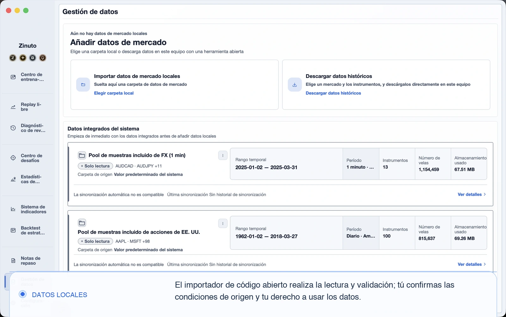

<a id="top"></a>

<table>
  <tr>
    <td width="34%" valign="middle" align="center">
      <p align="center"></p>
      <h1 align="center">Zinuto Core</h1>
      <p align="center">Un espacio de trabajo de escritorio, centrado en datos locales, para repetir mercados, practicar y probar estrategias.</p>
    </td>
    <td width="66%" valign="middle">
      <a href="https://www.zinuto.com/es/">
        
      </a>
    </td>
  </tr>
</table>

<p align="center">
  <a href="https://www.zinuto.com/es/"><strong>Sitio web oficial</strong></a> ·
  <a href="https://www.zinuto.com/es/download/"><strong>Descargar Zinuto oficial</strong></a> ·
  <a href="#build-and-run">Compilar Core</a> ·
  <a href="#contribute">Contribuir</a>
</p>

<p align="center">
  <a href="README.md">English</a> ·
  <a href="README.zh-CN.md">简体中文</a> ·
  <a href="README.ja.md">日本語</a> ·
  <a href="README.ko.md">한국어</a> ·
  <strong>Español</strong>
</p>

> Para la mayoría de las personas, [descargar la versión oficial de Zinuto](https://www.zinuto.com/es/download/) es la forma más sencilla de instalar, recibir actualizaciones y usar Zinuto. Este repositorio está pensado para quienes quieren leer el código, aprender de él, modificarlo o compilar por su cuenta la edición Core, que funciona de forma local.

## ¿Zinuto oficial o Zinuto Core?

| | Zinuto oficial | Zinuto Core |
| --- | --- | --- |
| Recomendado para | Quien busca una aplicación mantenida y lista para instalar | Quien quiere leer, modificar y compilar el código GPL |
| Instalación | Descarga de un instalador mantenido | Compilación local desde este repositorio |
| Cuenta y actualizaciones | Incluye reconocimiento de cuenta y canales de actualización oficiales | No incluye cuenta, servicio alojado ni actualizador del producto |
| Herramientas locales | Incluye el espacio de trabajo local de Core | Ejecuta ese espacio directamente desde el código fuente |
| Licencia | Consulta las condiciones de la distribución oficial | `GPL-3.0-only` |

Core no se conecta a un bróker ni envía órdenes reales. Es una herramienta de investigación y práctica, no asesoramiento financiero. Cuando los datos ya están disponibles en el equipo, las funciones principales no requieren una cuenta ni conexión permanente. Los conectores de datos opcionales solo realizan solicitudes cuando tú inicias una adquisición. Esas solicitudes salen directamente de tu equipo hacia el proveedor elegido, sin pasar por un servicio de Zinuto. El proveedor ve tu IP pública o la IP de salida de tu proxy o VPN.

## Qué puedes hacer

| Espacio | Para qué sirve |
| --- | --- |
| Datos locales | Previsualizar, asignar, validar e importar CSV, JSON, Parquet y XLSX |
| Repetición de mercado | Recorrer sesiones históricas, anotar decisiones y revisarlas después |
| Práctica | Usar operaciones simuladas, bancos de ejercicios y retos concretos |
| Backtesting | Ejecutar el motor de estrategias en Rust y revisar operaciones, métricas y gráficos |
| Revisión | Guardar notas, indicadores, historial, resultados y paquetes de datos portátiles |
| Idioma | Inglés, chino simplificado, japonés, coreano y español |

<table>
  <tr>
    <td width="50%" valign="top">
      <a href="docs/assets/readme/free-replay.es.webp"></a>
    </td>
    <td width="50%" valign="top">
      <a href="docs/assets/readme/directed-replay.es.webp"></a>
    </td>
  </tr>
  <tr>
    <td width="50%" valign="top">
      <a href="docs/assets/readme/flash-decision.es.webp"></a>
    </td>
    <td width="50%" valign="top">
      <a href="docs/assets/readme/strategy-backtests.es.webp"></a>
    </td>
  </tr>
  <tr>
    <td colspan="2" valign="top">
      <a href="docs/assets/readme/local-data.es.webp"></a>
    </td>
  </tr>
</table>

_Estas pantallas muestran flujos de entrenamiento simulado y datos locales. No contienen cuentas oficiales ni servicios privados._

Los datos de trabajo permanecen en el almacenamiento local de la aplicación, salvo que exportes expresamente un paquete portátil. Esos paquetes no están cifrados por diseño. Trátalos como archivos sensibles y guárdalos de forma adecuada.

<a id="build-and-run"></a>

## Compilar y ejecutar

### Requisitos

| Requisito | Nota |
| --- | --- |
| Git | Necesario para clonar y contribuir |
| Node.js | Usa la versión exacta indicada en [`.nvmrc`](.nvmrc) |
| Rust | Instala la cadena estable con [rustup](https://rustup.rs/) |
| uv | Usa la versión `0.11.8`; prepara el entorno de Python fijado por el proyecto |
| Herramientas del sistema | Sigue los [requisitos de Tauri 2](https://v2.tauri.app/start/prerequisites/) para macOS o Windows |

En macOS necesitas Xcode Command Line Tools. En Windows, instala Microsoft C++ Build Tools y WebView2 según las instrucciones de Tauri.

### Iniciar la aplicación de escritorio

```sh
git clone https://github.com/Zinuto-Official/zinuto-core.git
cd zinuto-core
npm ci
npm start
```

El primer inicio compila el entorno local de Node.js, el motor de backtesting en Rust y el proceso auxiliar de datos en Python con versiones fijadas. Puede tardar varios minutos y necesita conexión para obtener las dependencias de desarrollo. Las siguientes ejecuciones reutilizan la caché local.

### Crear un instalador

```sh
npm run package -- --output-dir /absolute/path/to/output
```

El comando crea un `Zinuto-Core-<version>.dmg` o `.exe` compilado por ti, junto con sumas de comprobación y pruebas de compilación. Zinuto no lo firma ni lo certifica, no es una versión oficial y los flujos de este repositorio nunca lo suben. Debes compilar el instalador en el sistema operativo al que va destinado; no se admite la compilación cruzada.

### Ejecutar las comprobaciones

```sh
npm run check:fast -- --working-tree
npm run check:affected -- --base origin/main --head HEAD
npm run check:public-repo
```

`npm run check:full` ejecuta la revisión completa para una versión candidata y tarda más. Consulta [CONTRIBUTING.md](CONTRIBUTING.md) para saber qué controles exige cada parte del código.

### Mapa del repositorio

| Ruta | Responsabilidad |
| --- | --- |
| `apps/desktop/web` | Interfaz React integrada en la aplicación de escritorio |
| `apps/desktop/local-api` | Servicios locales y almacenamiento SQLite/DuckDB |
| `apps/desktop/shell` | Ciclo de vida de Tauri, preparación de archivos y puente nativo |
| `apps/desktop/backtest-engine` | Proceso auxiliar de backtesting en Rust |
| `packages/shared` | Contratos, validación, lógica de dominio y textos en cinco idiomas |
| `contracts` | Contratos versionados para HTTP local y el puente nativo |
| `tools` | Compilación, empaquetado, generación y controles del repositorio |

Consulta [Arquitectura](docs/ARCHITECTURE.md) para entender los límites de diseño. El origen y las licencias de los datos de ejemplo están en [THIRD_PARTY_DATA.md](THIRD_PARTY_DATA.md).

<a id="contribute"></a>

## Contribuir

No hace falta entender todo el proyecto para ayudar. Un informe de error reproducible, una traducción más natural, una prueba concreta o un parche pequeño pueden ser muy útiles.

1. Busca entre los Issues existentes. Si nadie ha tratado el tema, abre un informe de error o una propuesta.
2. Haz un Fork del repositorio y crea una rama concreta dentro de tu Fork.
3. Lee [CONTRIBUTING.md](CONTRIBUTING.md), [GOVERNANCE.md](GOVERNANCE.md) y el acuerdo aplicable descrito en [CLA.md](CLA.md).
4. Limita cada cambio a un problema coherente. Si modificas texto visible, actualiza los cinco idiomas.
5. Ejecuta las comprobaciones afectadas y adjunta capturas cuando cambie la interfaz.
6. Abre un Pull Request hacia la rama predeterminada de este repositorio y explica el efecto para el usuario.

Los mantenedores trabajan en `main`. Las personas externas usan ramas dentro de sus propios Forks. Informa de problemas de seguridad de forma privada según [SECURITY.md](SECURITY.md), nunca en un Issue público.

<a id="developer-badge"></a>

## Activar la insignia de Desarrollador en Zinuto oficial

La insignia de Desarrollador reconoce contribuciones de código aceptadas. Pertenece a tu cuenta oficial de Zinuto; no desbloquea funciones de Core ni concede acceso de escritura al repositorio.

1. Inicia sesión en Zinuto oficial y abre **Centro de cuenta > Reconocimiento > Vincular GitHub**. La conexión solicita el permiso `read:user` de GitHub.
2. Envía un Pull Request al repositorio oficial de Zinuto Core. Debe proceder de una cuenta normal de GitHub, no de un bot, y dirigirse a la rama predeterminada del repositorio.
3. Un mantenedor revisa y fusiona la contribución.
4. Cuando el servicio oficial procesa la fusión, la insignia aparece en tu cuenta. También puede reconocer una contribución válida anterior si vinculas GitHub después.

La insignia es válida durante un año desde una contribución fusionada que cumpla los requisitos. Las estrellas, los Issues, los Pull Requests sin fusionar y las fusiones que solo existen en un Fork no la activan.

<a id="support"></a>

## Ayuda a que el proyecto continúe

Zinuto nació como una herramienta que queríamos usar nosotros mismos. Un grupo pequeño siguió construyéndola fuera del horario de trabajo porque creemos que practicar con atención no debería depender de un terminal costoso ni de una cuenta remota. Los cambios del sistema operativo, los formatos de datos, las pruebas, la documentación y cada respuesta bien pensada requieren tiempo real.

Si Zinuto te ha servido, puedes marcar el repositorio con una estrella, escribir un Issue útil, mejorar una traducción, enviar un parche o apoyar el trabajo de forma voluntaria. Cualquiera de esas acciones nos dice que merece la pena seguir.

<table>
  <tr>
    <td align="center" width="50%">
      <a href="https://www.zinuto.com/zh-CN/support-development/">
        
      </a>
    </td>
    <td align="center" width="50%">
      <a href="https://ko-fi.com/zinuto">
        
      </a>
    </td>
  </tr>
  <tr>
    <td align="center"><a href="https://www.zinuto.com/zh-CN/support-development/">Apoya a Zinuto a través del canal de Alipay del sitio web oficial</a></td>
    <td align="center"><strong>Ko-fi</strong><br><a href="https://ko-fi.com/zinuto">ko-fi.com/zinuto</a></td>
  </tr>
</table>

El apoyo es opcional. No compra funciones, prioridad, acceso ni resultados de inversión, y Core seguirá siendo software GPL. Si quieres obtener la insignia oficial de Colaborador, empieza desde el flujo de apoyo dentro de tu cuenta iniciada en Zinuto oficial para que la aportación pueda asociarse correctamente.

## Licencia, seguridad y marca

- Código: [`GPL-3.0-only`](LICENSE). Quienes contribuyen conservan sus derechos de autor; consulta [CLA.md](CLA.md).
- Seguridad: informa de vulnerabilidades de forma privada según [SECURITY.md](SECURITY.md).
- Redistribución: respeta [BRANDING.md](BRANDING.md) y [TRADEMARKS.md](TRADEMARKS.md). Una compilación modificada no puede presentarse como versión oficial de Zinuto.
- Avisos de terceros: [THIRD_PARTY_NOTICES.md](THIRD_PARTY_NOTICES.md).

<p align="center"><a href="#top">Volver arriba</a></p>
