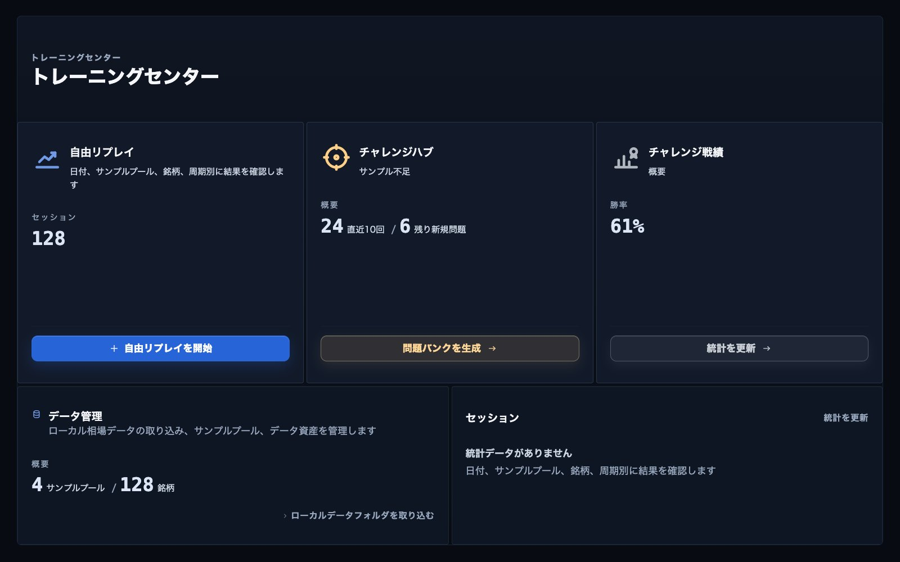
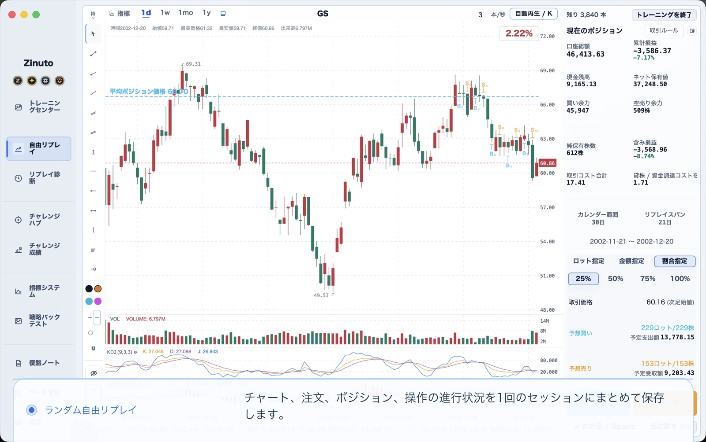
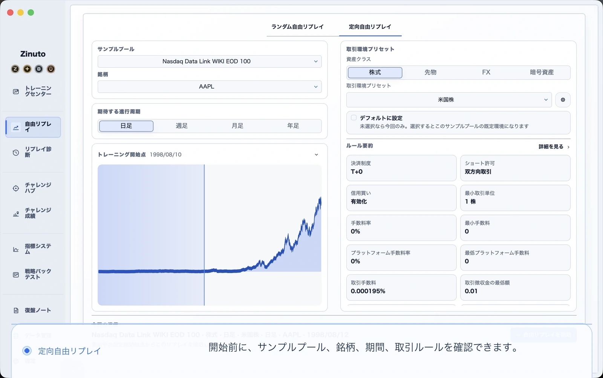
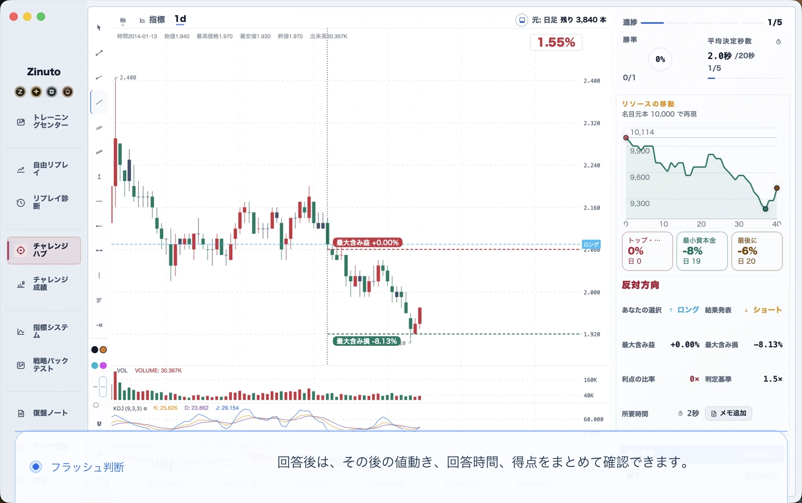
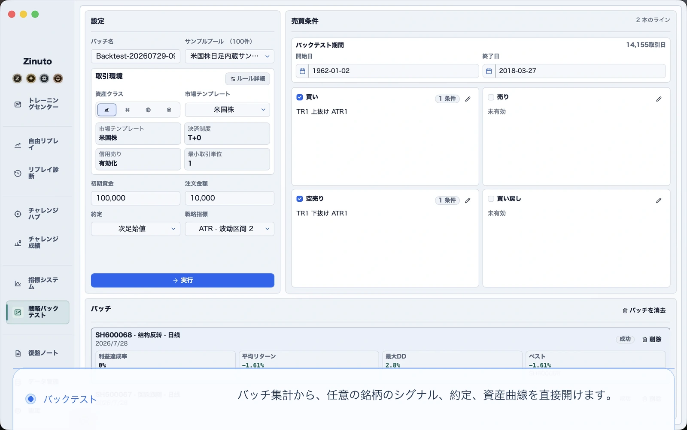
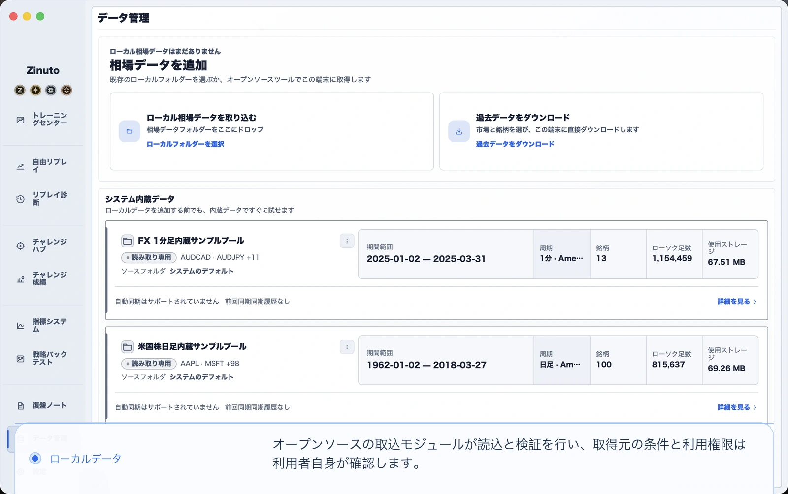
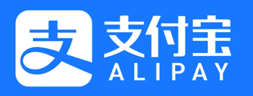

<a id="top"></a>

<table>
  <tr>
    <td width="34%" valign="middle" align="center">
      <p align="center"></p>
      <h1 align="center">Zinuto Core</h1>
      <p align="center">相場のリプレイ、反復練習、ストラテジーのバックテストを自分のコンピューターで行えるデスクトップ環境です。</p>
    </td>
    <td width="66%" valign="middle">
      <a href="https://www.zinuto.com/ja/">
        
      </a>
    </td>
  </tr>
</table>

<p align="center">
  <a href="https://www.zinuto.com/ja/"><strong>公式サイト</strong></a> ·
  <a href="https://www.zinuto.com/ja/download/"><strong>Zinuto 公式版をダウンロード</strong></a> ·
  <a href="#build-and-run">Core をビルド</a> ·
  <a href="#contribute">コントリビュート</a>
</p>

<p align="center">
  <a href="README.md">English</a> ·
  <a href="README.zh-CN.md">简体中文</a> ·
  <strong>日本語</strong> ·
  <a href="README.ko.md">한국어</a> ·
  <a href="README.es.md">Español</a>
</p>

> 多くの方には、インストールと更新が簡単な [Zinuto 公式版](https://www.zinuto.com/ja/download/) をおすすめします。このリポジトリは、コードを読みたい方、仕組みを学びたい方、機能を変更したい方、ローカル版の Core を自分でビルドしたい方のためのものです。

## Zinuto 公式版と Zinuto Core の違い

| | Zinuto 公式版 | Zinuto Core |
| --- | --- | --- |
| 向いている方 | メンテナンスされたアプリをすぐに使いたい方 | GPL ソースを読み、変更し、自分でビルドしたい方 |
| インストール | 公式インストーラーをダウンロード | このリポジトリからローカルでビルド |
| アカウントと更新 | 公式アカウントの認定と更新チャンネルを提供 | アカウント、ホスト型サービス、製品アップデーターは含まない |
| ローカル機能 | Core のローカルワークスペースを収録 | ローカルワークスペースをソースから直接実行 |
| ライセンス | 公式配布条件を参照 | `GPL-3.0-only` |

Core は証券会社に接続せず、実際の注文も出しません。調査と練習のためのツールであり、投資助言ではありません。データをローカルに用意すれば、主要な機能はアカウントや常時接続なしで利用できます。オプションのデータコネクターが通信するのは、利用者がデータ取得を開始したときだけです。リクエストは Zinuto のサービスを経由せず、お使いのコンピューターから選択したデータ提供元へ直接送られます。提供元から見えるのは、通常の公開 IP、プロキシ、または VPN の出口 IP です。

## できること

| ワークスペース | 用途 |
| --- | --- |
| ローカルデータ | CSV、JSON、Parquet、XLSX の確認、マッピング、検証、インポート |
| 相場リプレイ | 過去の相場を順に再生し、その時点の判断を記録して振り返る |
| 練習 | シミュレーション取引、トレーニング問題、テーマ別チャレンジ |
| バックテスト | Rust エンジンでストラテジーを実行し、約定、指標、チャートを確認 |
| 振り返り | ノート、インジケーター、履歴、保存結果、ポータブルデータを管理 |
| 言語 | 英語、簡体字中国語、日本語、韓国語、スペイン語 |

<table>
  <tr>
    <td width="50%" valign="top">
      <a href="docs/assets/readme/free-replay.ja.webp"></a>
    </td>
    <td width="50%" valign="top">
      <a href="docs/assets/readme/directed-replay.ja.webp"></a>
    </td>
  </tr>
  <tr>
    <td width="50%" valign="top">
      <a href="docs/assets/readme/flash-decision.ja.webp"></a>
    </td>
    <td width="50%" valign="top">
      <a href="docs/assets/readme/strategy-backtests.ja.webp"></a>
    </td>
  </tr>
  <tr>
    <td colspan="2" valign="top">
      <a href="docs/assets/readme/local-data.ja.webp"></a>
    </td>
  </tr>
</table>

_これらの画面はローカルのシミュレーション練習とデータワークフローを示しています。公式アカウントや非公開サービスは含まれていません。_

作業データは、ポータブルパッケージを明示的にエクスポートしない限り、アプリのローカルストレージに残ります。エクスポートしたパッケージは暗号化されない設計です。機密データとして適切に保管してください。

<a id="build-and-run"></a>

## ビルドと実行

### 必要な環境

| 要件 | 補足 |
| --- | --- |
| Git | クローンとコントリビュートに使用 |
| Node.js | [`.nvmrc`](.nvmrc) に記載された正確なバージョンを使用 |
| Rust | [rustup](https://rustup.rs/) で stable ツールチェーンを導入 |
| uv | バージョン `0.11.8` を使用。固定された Python 環境を準備します |
| システムツール | macOS または Windows 向けの [Tauri 2 前提条件](https://v2.tauri.app/start/prerequisites/)に従う |

macOS では Xcode Command Line Tools が必要です。Windows では Tauri の案内にある Microsoft C++ Build Tools と WebView2 を導入してください。

### デスクトップアプリを起動

```sh
git clone https://github.com/Zinuto-Official/zinuto-core.git
cd zinuto-core
npm ci
npm start
```

初回起動では、ローカルの Node.js ランタイム、Rust バックテストエンジン、固定バージョンの Python データサイドカーをビルドします。数分かかることがあり、開発用依存関係の取得にはネットワークが必要です。次回からはローカルキャッシュが再利用されます。

### インストーラーを作成

```sh
npm run package -- --output-dir /absolute/path/to/output
```

自己ビルド版の `Zinuto-Core-<version>.dmg` または `.exe` と、チェックサム、ビルド証跡が作成されます。Zinuto による署名や公証はなく、公式リリースではありません。このリポジトリのワークフローがアップロードすることもありません。インストーラーは対象 OS 上でビルドしてください。クロスプラットフォームのパッケージングには対応していません。

### チェックを実行

```sh
npm run check:fast -- --working-tree
npm run check:affected -- --base origin/main --head HEAD
npm run check:public-repo
```

`npm run check:full` は時間のかかる完全なリリース候補チェックです。コード領域ごとの必須チェックは [CONTRIBUTING.md](CONTRIBUTING.md) を参照してください。

### リポジトリ構成

| パス | 担当 |
| --- | --- |
| `apps/desktop/web` | デスクトップアプリ内の React インターフェース |
| `apps/desktop/local-api` | ローカルサービスと SQLite/DuckDB ストレージ |
| `apps/desktop/shell` | Tauri のライフサイクル、ファイル準備、ネイティブブリッジ |
| `apps/desktop/backtest-engine` | Rust バックテストサイドカー |
| `packages/shared` | コントラクト、検証、ドメインロジック、5言語の文言 |
| `contracts` | バージョン管理されたローカル HTTP とネイティブブリッジのコントラクト |
| `tools` | ビルド、パッケージング、生成、リポジトリチェック |

設計上の境界は[アーキテクチャ](docs/ARCHITECTURE.md)を参照してください。サンプルデータの出典とライセンスは [THIRD_PARTY_DATA.md](THIRD_PARTY_DATA.md) にあります。

<a id="contribute"></a>

## コントリビュート

プロジェクト全体を理解してから始める必要はありません。再現できるバグ報告、自然な翻訳、的を絞ったテスト、小さな修正も大切な貢献です。

1. 既存の Issue を検索し、まだ話題になっていなければバグ報告または機能提案を作成します。
2. リポジトリを Fork し、自分の Fork に目的を絞ったブランチを作成します。
3. [CONTRIBUTING.md](CONTRIBUTING.md)、[GOVERNANCE.md](GOVERNANCE.md)、[CLA.md](CLA.md) の該当する同意書を読みます。
4. 1つのまとまった変更に絞ります。画面に表示される文言を変える場合は5言語を同時に更新します。
5. 影響範囲のチェックを実行し、画面変更にはスクリーンショットを添えます。
6. このリポジトリのデフォルトブランチに Pull Request を作成し、利用者への影響を説明します。

メンテナーは `main` で開発し、外部コントリビューターは自分の Fork 内のブランチを使います。セキュリティ問題は公開 Issue にせず、[SECURITY.md](SECURITY.md) に従って非公開で報告してください。

<a id="developer-badge"></a>

## Zinuto 公式版の開発者バッジを有効にする

開発者バッジは、採用されたコード貢献への認定です。公式 Zinuto アカウントに表示されるもので、Core の機能やリポジトリの書き込み権限を付与するものではありません。

1. Zinuto 公式版にサインインし、**アカウントセンター > 認定 > GitHub を連携**を開きます。連携時に求める GitHub 権限は `read:user` です。
2. Zinuto Core の公式リポジトリへ Pull Request を送ります。ボットではない通常の GitHub ユーザーが作成し、リポジトリのデフォルトブランチを対象にする必要があります。
3. メンテナーがレビューし、貢献をマージします。
4. 公式サービスがマージ記録を処理すると、アカウントに開発者バッジが表示されます。GitHub 連携前の対象貢献も、連携後に照合できます。

条件を満たしたマージから1年間、バッジは有効です。Star、Issue、未マージの Pull Request、自分の Fork 内だけのマージでは有効になりません。

<a id="support"></a>

## プロジェクトを続けるために

Zinuto は、私たち自身が使いたいと思った道具から始まりました。丁寧な練習に高価な端末やリモートアカウントは必要ないはずだと考え、少人数で仕事の合間に作り続けています。OS の変更、データ形式への対応、テスト、ドキュメント、ひとつひとつの返信には、どれも時間がかかります。

Zinuto が役に立ったなら、Star、内容のある Issue、翻訳の改善、パッチ、任意の支援という形で参加できます。どの形も、このプロジェクトを続ける理由になります。

<table>
  <tr>
    <td align="center" width="50%">
      <a href="https://www.zinuto.com/zh-CN/support-development/">
        
      </a>
    </td>
    <td align="center" width="50%">
      <a href="https://ko-fi.com/zinuto">
        
      </a>
    </td>
  </tr>
  <tr>
    <td align="center"><a href="https://www.zinuto.com/zh-CN/support-development/">公式サイトの Alipay チャネルを通じて支援</a></td>
    <td align="center"><strong>Ko-fi</strong><br><a href="https://ko-fi.com/zinuto">ko-fi.com/zinuto</a></td>
  </tr>
</table>

支援は任意です。機能、優先対応、アクセス権、投資成果を購入するものではなく、Core は引き続き GPL ソフトウェアです。公式サポーターバッジを希望する場合は、支援記録を正しく関連付けるため、サインインした Zinuto 公式版の支援フローから始めてください。

## ライセンス、セキュリティ、ブランド

- コード: [`GPL-3.0-only`](LICENSE)。著作権はコントリビューターに残ります。詳しくは [CLA.md](CLA.md) を参照してください。
- セキュリティ: [SECURITY.md](SECURITY.md) に従い、脆弱性は非公開で報告してください。
- 再配布: [BRANDING.md](BRANDING.md) と [TRADEMARKS.md](TRADEMARKS.md) に従ってください。変更したビルドを Zinuto の公式リリースとして表示することはできません。
- サードパーティ通知: [THIRD_PARTY_NOTICES.md](THIRD_PARTY_NOTICES.md)。

<p align="center"><a href="#top">先頭へ戻る</a></p>
