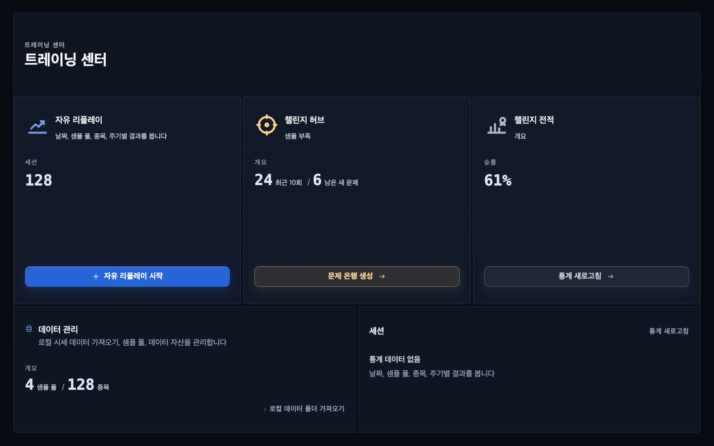
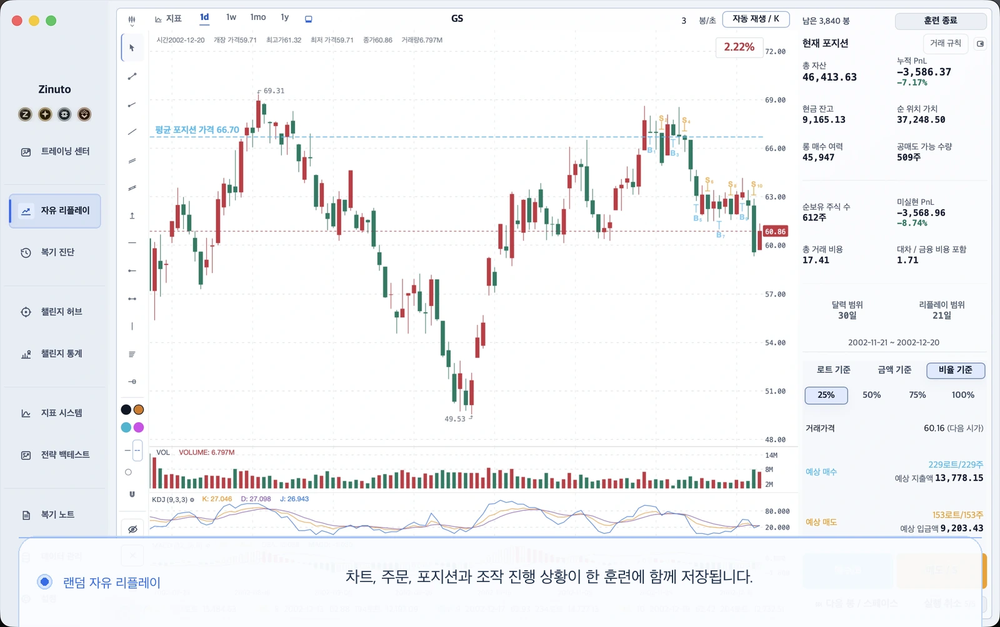
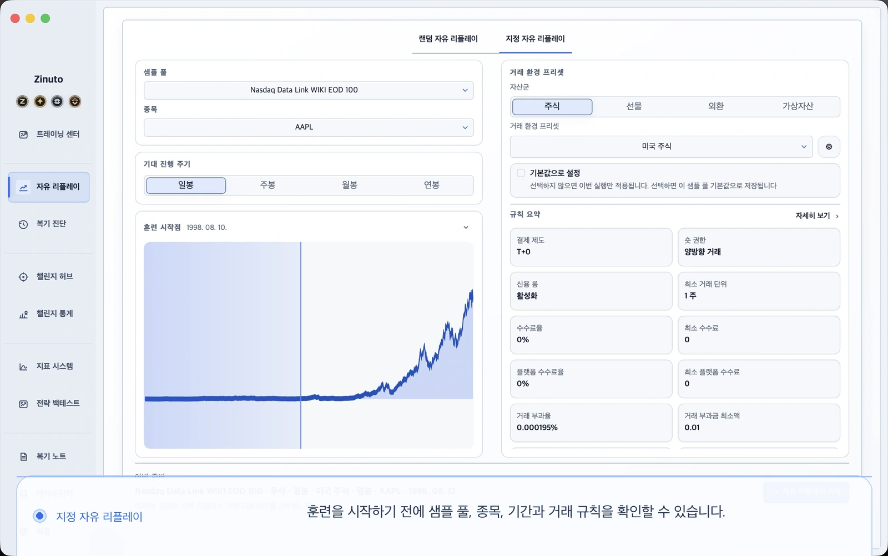
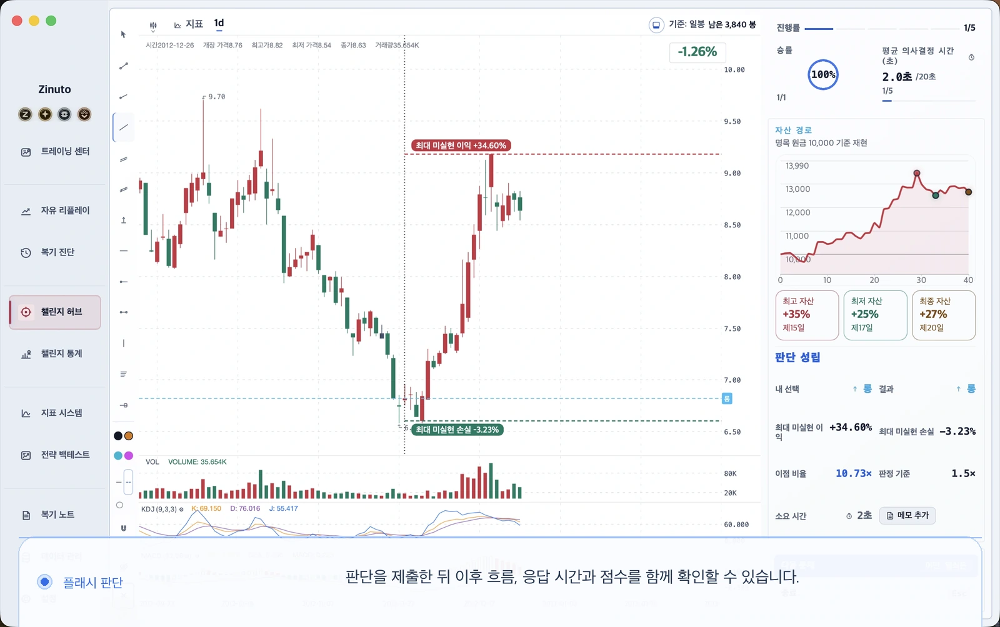
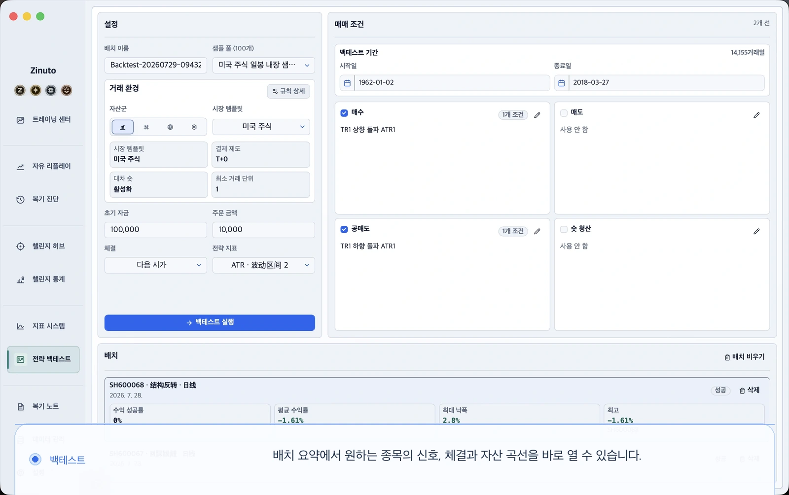
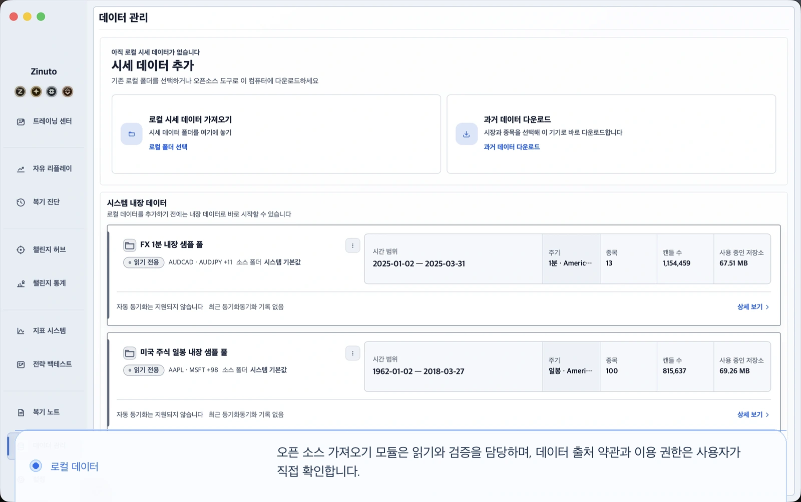

<a id="top"></a>

<table>
  <tr>
    <td width="34%" valign="middle" align="center">
      <p align="center"></p>
      <h1 align="center">Zinuto Core</h1>
      <p align="center">시장 리플레이, 반복 훈련, 전략 백테스트를 내 컴퓨터에서 할 수 있는 데스크톱 작업 공간입니다.</p>
    </td>
    <td width="66%" valign="middle">
      <a href="https://www.zinuto.com/ko/">
        
      </a>
    </td>
  </tr>
</table>

<p align="center">
  <a href="https://www.zinuto.com/ko/"><strong>공식 웹사이트</strong></a> ·
  <a href="https://www.zinuto.com/ko/download/"><strong>Zinuto 공식 버전 다운로드</strong></a> ·
  <a href="#build-and-run">Core 빌드</a> ·
  <a href="#contribute">기여하기</a>
</p>

<p align="center">
  <a href="README.md">English</a> ·
  <a href="README.zh-CN.md">简体中文</a> ·
  <a href="README.ja.md">日本語</a> ·
  <strong>한국어</strong> ·
  <a href="README.es.md">Español</a>
</p>

> 대부분의 사용자에게는 설치와 업데이트가 간편한 [Zinuto 공식 버전](https://www.zinuto.com/ko/download/)이 알맞습니다. 이 저장소는 코드를 살펴보고, 구현을 배우고, 기능을 바꾸거나 완전한 로컬 Core 버전을 직접 빌드하려는 분을 위한 공간입니다.

## Zinuto 공식 버전과 Zinuto Core

| | Zinuto 공식 버전 | Zinuto Core |
| --- | --- | --- |
| 권장 대상 | 관리되는 앱을 바로 설치해 사용하려는 분 | GPL 소스를 읽고, 수정하고, 직접 빌드하려는 분 |
| 설치 | 관리되는 설치 파일 다운로드 | 이 저장소에서 로컬 빌드 |
| 계정과 업데이트 | 공식 계정 인증 및 업데이트 채널 제공 | 계정, 호스팅 서비스, 제품 업데이트 기능 없음 |
| 로컬 도구 | Core 로컬 작업 공간 포함 | 소스에서 로컬 작업 공간을 직접 실행 |
| 라이선스 | 공식 배포 조건 참고 | `GPL-3.0-only` |

Core는 증권사에 연결하거나 실제 주문을 전송하지 않습니다. 연구와 연습을 위한 도구이며 투자 조언이 아닙니다. 데이터를 로컬에 준비한 뒤에는 계정이나 지속적인 인터넷 연결 없이 주요 기능을 사용할 수 있습니다. 선택형 데이터 커넥터는 사용자가 데이터 수집을 시작할 때만 외부에 요청합니다. 이 요청은 Zinuto 서비스를 거치지 않고 사용자의 컴퓨터에서 선택한 데이터 제공처로 직접 전송됩니다. 데이터 제공처에는 사용자의 공인 IP 또는 프록시나 VPN의 출구 IP가 보입니다.

## 할 수 있는 일

| 작업 공간 | 용도 |
| --- | --- |
| 로컬 데이터 | CSV, JSON, Parquet, XLSX 파일 미리 보기, 매핑, 검증, 가져오기 |
| 시장 리플레이 | 과거 장면을 단계별로 되짚으며 당시 판단을 기록하고 나중에 검토 |
| 훈련 | 모의 거래, 훈련 문제, 집중 챌린지 반복 연습 |
| 백테스트 | Rust 전략 엔진을 실행하고 체결, 지표, 차트 확인 |
| 검토 | 노트, 지표, 기록, 저장 결과, 이동식 데이터 패키지 관리 |
| 언어 | 영어, 중국어 간체, 일본어, 한국어, 스페인어 |

<table>
  <tr>
    <td width="50%" valign="top">
      <a href="docs/assets/readme/free-replay.ko.webp"></a>
    </td>
    <td width="50%" valign="top">
      <a href="docs/assets/readme/directed-replay.ko.webp"></a>
    </td>
  </tr>
  <tr>
    <td width="50%" valign="top">
      <a href="docs/assets/readme/flash-decision.ko.webp"></a>
    </td>
    <td width="50%" valign="top">
      <a href="docs/assets/readme/strategy-backtests.ko.webp"></a>
    </td>
  </tr>
  <tr>
    <td colspan="2" valign="top">
      <a href="docs/assets/readme/local-data.ko.webp"></a>
    </td>
  </tr>
</table>

_이 화면들은 로컬 모의 훈련과 데이터 작업 흐름을 보여 줍니다. 공식 계정이나 비공개 서비스는 포함하지 않습니다._

이동식 패키지를 직접 내보내지 않는 한 작업 데이터는 앱의 로컬 저장소에 남습니다. 내보낸 패키지는 설계상 암호화되지 않으므로 민감한 파일처럼 안전하게 보관하세요.

<a id="build-and-run"></a>

## 빌드 및 실행

### 준비 사항

| 요구 사항 | 설명 |
| --- | --- |
| Git | 복제 및 기여에 필요 |
| Node.js | [`.nvmrc`](.nvmrc)에 지정된 정확한 버전 사용 |
| Rust | [rustup](https://rustup.rs/)으로 stable 툴체인 설치 |
| uv | `0.11.8` 사용. 고정된 Python 런타임을 준비합니다 |
| 시스템 도구 | macOS 또는 Windows용 [Tauri 2 필수 조건](https://v2.tauri.app/start/prerequisites/)을 따르세요 |

macOS에는 Xcode Command Line Tools가 필요합니다. Windows에는 Tauri 문서에 나온 Microsoft C++ Build Tools와 WebView2를 설치하세요.

### 데스크톱 앱 시작

```sh
git clone https://github.com/Zinuto-Official/zinuto-core.git
cd zinuto-core
npm ci
npm start
```

처음 실행할 때 로컬 Node.js 런타임, Rust 백테스트 엔진, 고정 버전 Python 데이터 사이드카를 빌드합니다. 몇 분이 걸릴 수 있으며 개발 의존성을 받으려면 네트워크 연결이 필요합니다. 다음 실행부터는 로컬 빌드 캐시를 재사용합니다.

### 설치 파일 빌드

```sh
npm run package -- --output-dir /absolute/path/to/output
```

직접 빌드한 `Zinuto-Core-<version>.dmg` 또는 `.exe`와 체크섬, 빌드 증거가 생성됩니다. Zinuto의 서명이나 공증을 받지 않은 비공식 빌드이며 이 저장소의 워크플로가 업로드하지 않습니다. 교차 플랫폼 패키징은 지원하지 않으므로 대상 운영체제에서 빌드하세요.

### 검사 실행

```sh
npm run check:fast -- --working-tree
npm run check:affected -- --base origin/main --head HEAD
npm run check:public-repo
```

`npm run check:full`은 시간이 더 걸리는 전체 릴리스 후보 검사입니다. 코드 영역별 필수 검사는 [CONTRIBUTING.md](CONTRIBUTING.md)를 참고하세요.

### 저장소 구조

| 경로 | 역할 |
| --- | --- |
| `apps/desktop/web` | 데스크톱 앱에 포함되는 React 인터페이스 |
| `apps/desktop/local-api` | 로컬 애플리케이션 서비스와 SQLite/DuckDB 저장소 |
| `apps/desktop/shell` | Tauri 수명 주기, 파일 스테이징, 네이티브 브리지 |
| `apps/desktop/backtest-engine` | Rust 백테스트 사이드카 |
| `packages/shared` | 계약, 검증, 도메인 로직, 5개 언어 문구 |
| `contracts` | 버전이 지정된 로컬 HTTP 및 네이티브 브리지 계약 |
| `tools` | 빌드, 패키징, 생성, 저장소 검사 도구 |

설계 경계는 [아키텍처 문서](docs/ARCHITECTURE.md)에서 확인하세요. 샘플 데이터의 출처와 라이선스는 [THIRD_PARTY_DATA.md](THIRD_PARTY_DATA.md)에 있습니다.

<a id="contribute"></a>

## 기여하기

프로젝트 전체를 이해한 뒤에 시작할 필요는 없습니다. 재현 가능한 버그 제보, 더 자연스러운 번역, 범위가 분명한 테스트, 작은 수정도 소중합니다.

1. 기존 Issue를 검색하고 아직 논의되지 않은 작업이면 버그 또는 기능 요청을 엽니다.
2. 저장소를 Fork하고 자신의 Fork에 목적이 분명한 브랜치를 만듭니다.
3. [CONTRIBUTING.md](CONTRIBUTING.md), [GOVERNANCE.md](GOVERNANCE.md), [CLA.md](CLA.md)의 해당 기여 계약을 읽습니다.
4. 한 번에 하나의 완결된 변경에 집중합니다. 사용자에게 보이는 문구를 바꾸면 5개 언어를 함께 수정합니다.
5. 영향받는 검사를 실행하고 화면 변경에는 스크린샷을 첨부합니다.
6. 이 저장소의 기본 브랜치로 Pull Request를 열고 사용자에게 미치는 영향을 설명합니다.

관리자는 `main`에서 개발하고 외부 기여자는 자신의 Fork 안에서 브랜치를 사용합니다. 보안 문제는 공개 Issue로 올리지 말고 [SECURITY.md](SECURITY.md)에 따라 비공개로 알려 주세요.

<a id="developer-badge"></a>

## Zinuto 공식 버전에서 개발자 배지 켜기

개발자 배지는 채택된 코드 기여를 인정하는 표시입니다. 공식 Zinuto 계정에 표시되며 Core 기능을 열거나 저장소 쓰기 권한을 주지는 않습니다.

1. Zinuto 공식 버전에 로그인한 뒤 **계정 센터 > 인정 > GitHub 연결**을 엽니다. 연결할 때 요청하는 GitHub 권한은 `read:user`입니다.
2. Zinuto Core 공식 저장소에 Pull Request를 제출합니다. 봇이 아닌 일반 GitHub 사용자 계정이 작성해야 하며 저장소의 기본 브랜치를 대상으로 해야 합니다.
3. 관리자가 기여 내용을 검토하고 병합합니다.
4. 공식 서비스가 병합 기록을 처리하면 계정에 개발자 배지가 표시됩니다. GitHub 연결 전에 이루어진 적격 기여도 연결 후 다시 확인할 수 있습니다.

조건을 충족한 병합 기여 시점부터 배지는 1년 동안 유효합니다. Star, Issue, 병합되지 않은 Pull Request, 개인 Fork 안에서만 이루어진 병합은 배지를 활성화하지 않습니다.

<a id="support"></a>

## 프로젝트가 계속 나아갈 수 있도록

Zinuto는 우리가 직접 쓰고 싶었던 도구에서 시작했습니다. 신중한 연습에 비싼 단말이나 원격 계정이 꼭 필요하지는 않다고 믿었기에, 소수의 사람들이 본업이 끝난 뒤에도 조금씩 만들어 왔습니다. 운영체제 변화, 데이터 형식 대응, 테스트, 문서, 성실한 답변에는 모두 실제 시간이 듭니다.

Zinuto가 도움이 되었다면 저장소에 Star를 남기거나, 유용한 Issue를 작성하거나, 번역을 다듬거나, 패치를 제출하거나, 자발적으로 개발을 후원할 수 있습니다. 어떤 방식이든 이 프로젝트를 계속할 이유가 됩니다.

<table>
  <tr>
    <td align="center" width="50%">
      <a href="https://www.zinuto.com/zh-CN/support-development/">
        
      </a>
    </td>
    <td align="center" width="50%">
      <a href="https://ko-fi.com/zinuto">
        
      </a>
    </td>
  </tr>
  <tr>
    <td align="center"><a href="https://www.zinuto.com/zh-CN/support-development/">공식 웹사이트의 Alipay 채널을 통해 후원</a></td>
    <td align="center"><strong>Ko-fi</strong><br><a href="https://ko-fi.com/zinuto">ko-fi.com/zinuto</a></td>
  </tr>
</table>

후원은 선택 사항입니다. 기능, 우선 처리, 접근 권한, 투자 성과를 구매하는 것이 아니며 Core는 계속 GPL 소프트웨어로 남습니다. 공식 후원자 배지를 원한다면 후원 기록이 올바르게 연결되도록 로그인한 Zinuto 공식 버전 안의 후원 절차에서 시작하세요.

## 라이선스, 보안, 브랜드

- 코드: [`GPL-3.0-only`](LICENSE). 기여자는 저작권을 보유합니다. [CLA.md](CLA.md)를 참고하세요.
- 보안: [SECURITY.md](SECURITY.md)에 따라 취약점을 비공개로 제보하세요.
- 재배포: [BRANDING.md](BRANDING.md)와 [TRADEMARKS.md](TRADEMARKS.md)를 따르세요. 수정한 빌드를 Zinuto 공식 릴리스로 표시할 수 없습니다.
- 제3자 고지: [THIRD_PARTY_NOTICES.md](THIRD_PARTY_NOTICES.md).

<p align="center"><a href="#top">맨 위로</a></p>
