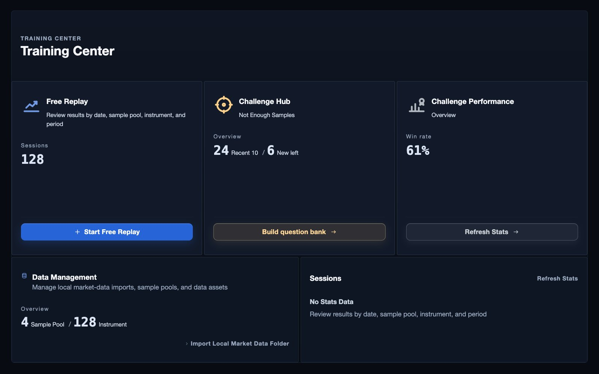
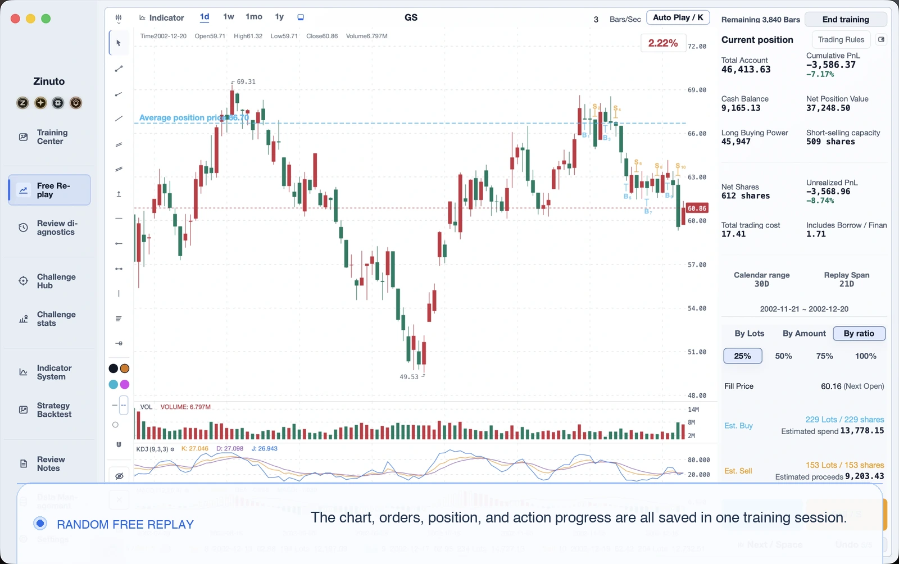
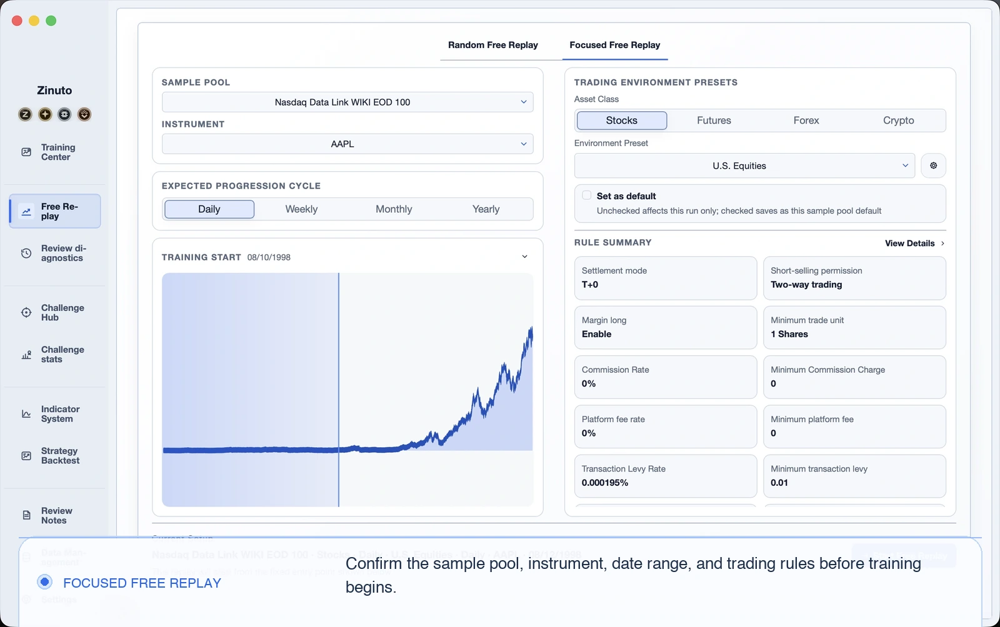
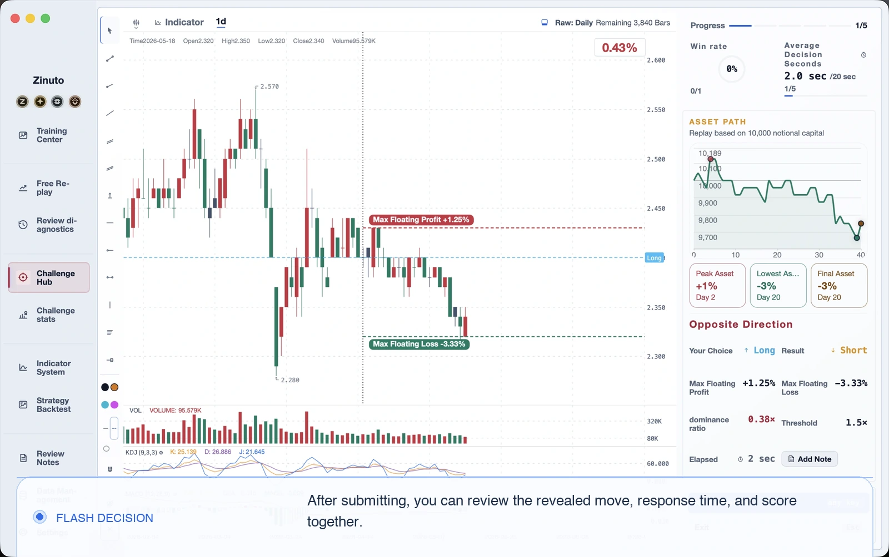
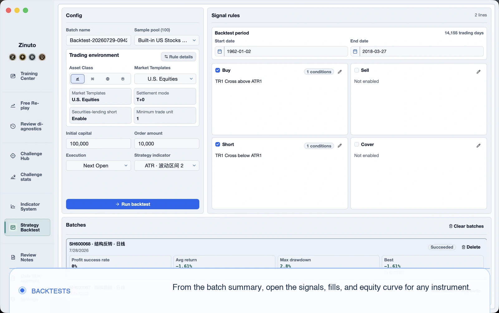
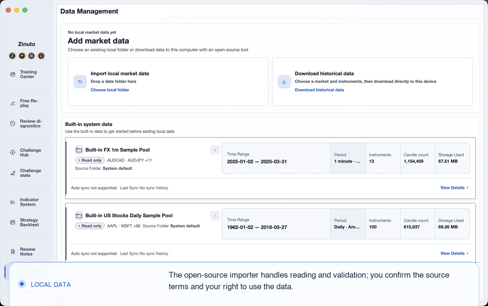

<a id="top"></a>

<table>
  <tr>
    <td width="34%" valign="middle" align="center">
      <p align="center"></p>
      <h1 align="center">Zinuto Core</h1>
      <p align="center">A desktop workspace for market replay, deliberate practice, and strategy backtesting on your own computer.</p>
    </td>
    <td width="66%" valign="middle">
      <a href="https://www.zinuto.com/en/">
        
      </a>
    </td>
  </tr>
</table>

<p align="center">
  <a href="https://www.zinuto.com/en/"><strong>Official website</strong></a> ·
  <a href="https://www.zinuto.com/en/download/"><strong>Download official Zinuto</strong></a> ·
  <a href="#build-and-run">Build Core</a> ·
  <a href="#contribute">Contribute</a>
</p>

<p align="center">
  <strong>English</strong> ·
  <a href="README.zh-CN.md">简体中文</a> ·
  <a href="README.ja.md">日本語</a> ·
  <a href="README.ko.md">한국어</a> ·
  <a href="README.es.md">Español</a>
</p>

> For most people, the [official Zinuto download](https://www.zinuto.com/en/download/) is the easiest way to install, update, and use Zinuto. This repository is for people who want to inspect the code, learn from it, change it, or build the fully local Core edition themselves.

## Official Zinuto or Zinuto Core?

| | Official Zinuto | Zinuto Core |
| --- | --- | --- |
| Best for | A maintained, ready-to-install experience | Reading, changing, and self-building the GPL source |
| Installation | Download a maintained installer | Build locally from this repository |
| Account and updates | Includes official account recognition and update channels | No account, hosted service, or product updater |
| Local tools | Includes the Core local workspace | Includes the local workspace directly from source |
| License | See the official distribution terms | `GPL-3.0-only` |

Core does not connect to a broker or place real orders. It is a research and practice tool, not investment advice. Once your data is available locally, the main workspace can be used without an account or a continuous network connection. Optional data connectors make outbound requests only when you start an acquisition. Those requests go directly from your computer to the selected provider, not through a Zinuto service. The provider sees your public IP or the egress IP of your proxy or VPN.

## What you can do

| Workspace | What it helps you do |
| --- | --- |
| Local data | Preview, map, validate, and import CSV, JSON, Parquet, and XLSX files |
| Market replay | Step through historical sessions, record decisions, and review them later |
| Practice | Use simulated trading, training banks, and focused challenges |
| Backtesting | Run the Rust strategy engine and inspect fills, metrics, and charts |
| Review | Keep notes, indicators, history, saved results, and portable data packages |
| Language | Use English, Simplified Chinese, Japanese, Korean, or Spanish |

<table>
  <tr>
    <td width="50%" valign="top">
      <a href="docs/assets/readme/free-replay.en.webp"></a>
    </td>
    <td width="50%" valign="top">
      <a href="docs/assets/readme/directed-replay.en.webp"></a>
    </td>
  </tr>
  <tr>
    <td width="50%" valign="top">
      <a href="docs/assets/readme/flash-decision.en.webp"></a>
    </td>
    <td width="50%" valign="top">
      <a href="docs/assets/readme/strategy-backtests.en.webp"></a>
    </td>
  </tr>
  <tr>
    <td colspan="2" valign="top">
      <a href="docs/assets/readme/local-data.en.webp"></a>
    </td>
  </tr>
</table>

_These screens show local simulated training and data workflows. They contain no official account or private service layer._

Your working data stays in local application storage unless you explicitly export a portable package. Portable packages are unencrypted by design, so treat exported files as sensitive and store them accordingly.

<a id="build-and-run"></a>

## Build and run

### Prerequisites

| Requirement | Notes |
| --- | --- |
| Git | Required to clone and contribute |
| Node.js | Use the exact version in [`.nvmrc`](.nvmrc) |
| Rust | Install the stable toolchain with [rustup](https://rustup.rs/) |
| uv | Use version `0.11.8`; it provisions the pinned Python runtime |
| System tools | Follow the [Tauri 2 prerequisites](https://v2.tauri.app/start/prerequisites/) for macOS or Windows |

On macOS, install Xcode Command Line Tools. On Windows, install the Microsoft C++ Build Tools and WebView2 listed by Tauri.

### Start the desktop app

```sh
git clone https://github.com/Zinuto-Official/zinuto-core.git
cd zinuto-core
npm ci
npm start
```

The first run builds the local Node.js runtime, Rust backtest engine, and pinned Python data sidecar. It can take several minutes and needs network access to fetch development dependencies. Later runs reuse the local build cache.

### Build an installer

```sh
npm run package -- --output-dir /absolute/path/to/output
```

This creates a self-built `Zinuto-Core-<version>.dmg` or `.exe` with checksums and build evidence. It is not signed or notarized by Zinuto, is not an official release, and is never uploaded by this repository's workflows. Cross-platform packaging is not supported, so build the installer on its target operating system.

### Run the checks

```sh
npm run check:fast -- --working-tree
npm run check:affected -- --base origin/main --head HEAD
npm run check:public-repo
```

`npm run check:full` is the complete release-candidate gate and takes longer. See [CONTRIBUTING.md](CONTRIBUTING.md) for the checks required by each part of the codebase.

### Repository map

| Path | Responsibility |
| --- | --- |
| `apps/desktop/web` | React interface embedded in the desktop app |
| `apps/desktop/local-api` | Local application services and SQLite/DuckDB storage |
| `apps/desktop/shell` | Tauri lifecycle, filesystem staging, and native bridge |
| `apps/desktop/backtest-engine` | Rust backtest sidecar |
| `packages/shared` | Contracts, validation, domain logic, and five-language copy |
| `contracts` | Versioned local HTTP and native bridge contracts |
| `tools` | Build, packaging, generation, and repository checks |

For design boundaries, start with [Architecture](docs/ARCHITECTURE.md). For sample-data sources and licenses, see [THIRD_PARTY_DATA.md](THIRD_PARTY_DATA.md).

<a id="contribute"></a>

## Contribute

You do not need to understand the whole project before helping. A reproducible bug report, a clearer translation, a focused test, or a small patch can be valuable.

1. Search existing issues. Open a bug or feature request if the work has not been discussed.
2. Fork the repository and create a focused branch in your fork.
3. Read [CONTRIBUTING.md](CONTRIBUTING.md), [GOVERNANCE.md](GOVERNANCE.md), and the applicable license agreement in [CLA.md](CLA.md).
4. Make one coherent change. Update all five locales when user-visible copy changes.
5. Run the affected checks and add screenshots for visible interface changes.
6. Open a pull request to this repository's default branch and explain the user impact.

Maintainers develop on `main`. External contributors use branches in their own forks. Please report security issues privately through [SECURITY.md](SECURITY.md), not through a public issue.

<a id="developer-badge"></a>

## Light up the Developer badge in official Zinuto

The Developer badge recognizes accepted code contributions. It belongs to your official Zinuto account and does not unlock Core features or grant repository access.

1. In official Zinuto, sign in and open **Account Center > Recognition > Link GitHub**. The connection requests GitHub's `read:user` scope.
2. Submit a pull request to the official Zinuto Core repository. The pull request must target the repository's default branch and come from a normal GitHub user account, not a bot.
3. A maintainer reviews and merges the contribution.
4. After the official service processes the merged contribution, the Developer badge appears in your account. An eligible contribution made before linking can also be reconciled after you connect GitHub.

The badge remains valid for one year from a qualifying merged contribution. Stars, issues, unmerged pull requests, and merges that exist only inside a fork do not activate it.

<a id="support"></a>

## Keep the project moving

Zinuto began as a tool we wanted to use ourselves. A small group kept building it after work because we believe careful practice should not depend on an expensive terminal or a remote account. Operating-system changes, data formats, testing, documentation, and thoughtful replies all take real time.

If Zinuto has helped you, you can star the repository, write a useful issue, improve a translation, submit a patch, or support the work voluntarily. Each of those tells us the project is worth carrying forward.

<table>
  <tr>
    <td align="center" width="50%">
      <a href="https://www.zinuto.com/zh-CN/support-development/">
        
      </a>
    </td>
    <td align="center" width="50%">
      <a href="https://ko-fi.com/zinuto">
        
      </a>
    </td>
  </tr>
  <tr>
    <td align="center"><a href="https://www.zinuto.com/zh-CN/support-development/">Support through the official Alipay channel</a></td>
    <td align="center"><strong>Ko-fi</strong><br><a href="https://ko-fi.com/zinuto">ko-fi.com/zinuto</a></td>
  </tr>
</table>

Support is optional. It does not buy features, priority, access, or investment results, and Core remains GPL software. If you want an official Supporter badge, begin from the support flow inside your signed-in official Zinuto account so the contribution can be associated correctly.

Official Zinuto also offers four optional digital Support Medals. A medal is a public thank-you and collectible, never a feature unlock. [View the medals and open the matching tier in the installed official app](https://www.zinuto.com/en/support-medals/?source=github-readme).

## License, safety, and brand

- Code: [`GPL-3.0-only`](LICENSE). Contributors retain copyright; see [CLA.md](CLA.md).
- Security: report vulnerabilities privately as described in [SECURITY.md](SECURITY.md).
- Redistribution: follow [BRANDING.md](BRANDING.md) and [TRADEMARKS.md](TRADEMARKS.md). A modified build must not present itself as an official Zinuto release.
- Third-party notices: [THIRD_PARTY_NOTICES.md](THIRD_PARTY_NOTICES.md).

<p align="center"><a href="#top">Back to top</a></p>
