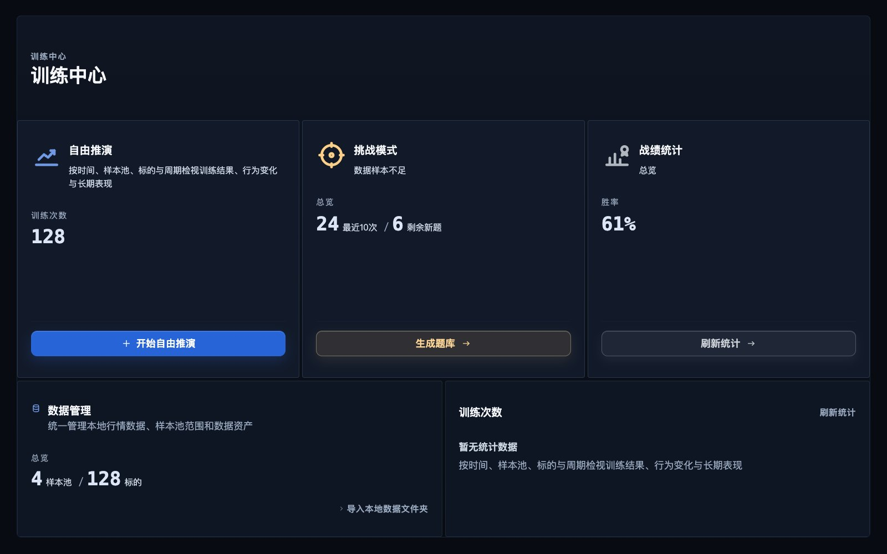
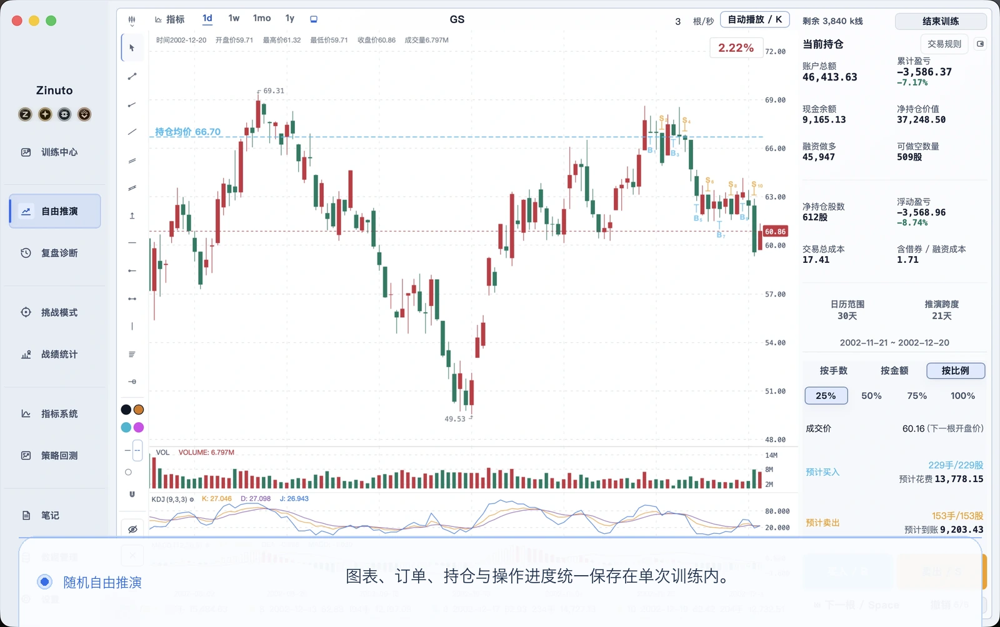
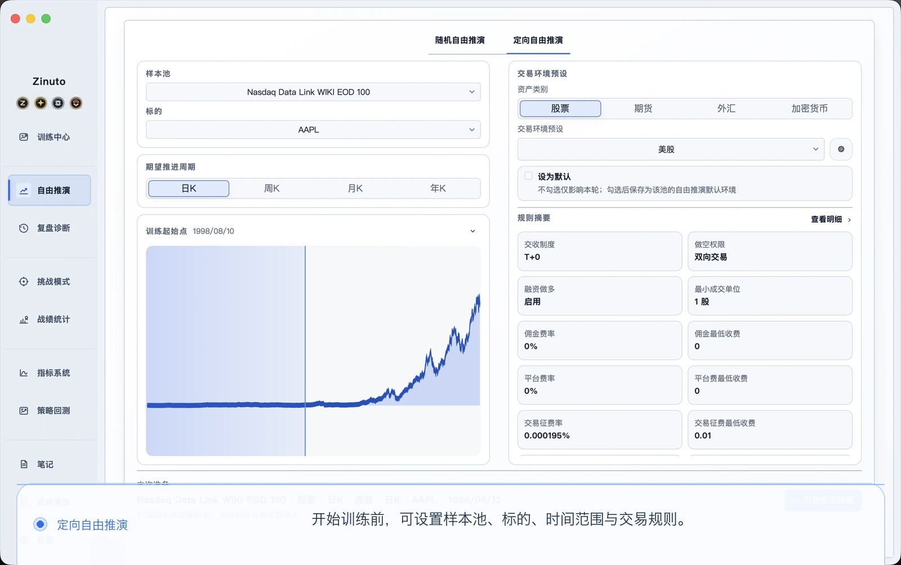
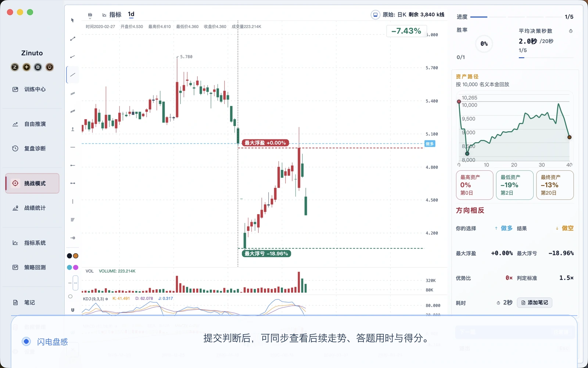
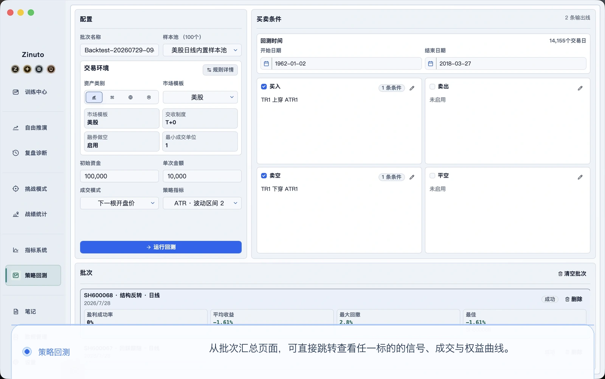
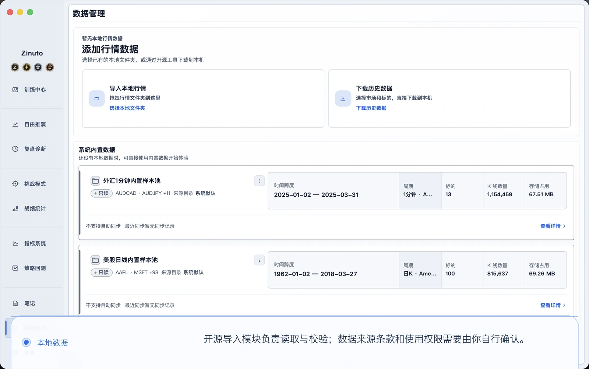

<a id="top"></a>

<table>
  <tr>
    <td width="34%" valign="middle" align="center">
      <p align="center"></p>
      <h1 align="center">Zinuto Core</h1>
      <p align="center">一套在自己电脑上完成行情复盘、刻意练习和策略回测的桌面工作台。</p>
    </td>
    <td width="66%" valign="middle">
      <a href="https://www.zinuto.com/zh-CN/">
        
      </a>
    </td>
  </tr>
</table>

<p align="center">
  <a href="https://www.zinuto.com/zh-CN/"><strong>访问官方网站</strong></a> ·
  <a href="https://www.zinuto.com/zh-CN/download/"><strong>下载 Zinuto 官方版</strong></a> ·
  <a href="#build-and-run">构建 Core</a> ·
  <a href="#contribute">参与贡献</a>
</p>

<p align="center">
  <a href="README.md">English</a> ·
  <strong>简体中文</strong> ·
  <a href="README.ja.md">日本語</a> ·
  <a href="README.ko.md">한국어</a> ·
  <a href="README.es.md">Español</a>
</p>

> 对大多数用户来说，[下载 Zinuto 官方版](https://www.zinuto.com/zh-CN/download/)是最省心的选择，可以直接安装、接收更新并使用完整的官方体验。这个仓库更适合希望阅读源码、学习实现、修改功能或亲自构建纯本地 Core 版的人。

## Zinuto 官方版和 Zinuto Core 有什么区别？

| | Zinuto 官方版 | Zinuto Core |
| --- | --- | --- |
| 更适合 | 希望开箱即用的普通用户 | 希望阅读、修改或自行构建 GPL 源码的人 |
| 安装方式 | 下载维护中的安装包 | 从本仓库在本地构建 |
| 账户与更新 | 提供官方账户身份和更新渠道 | 不含账户、在线服务和产品更新器 |
| 本地工具 | 包含 Core 的本地工作台 | 直接从源码运行本地工作台 |
| 许可证 | 以官方发行条款为准 | `GPL-3.0-only` |

Core 不连接券商，也不会下真实订单。它用于研究和练习，不构成投资建议。本地数据准备好以后，主要工作流不需要账户，也不需要持续联网。只有在你主动开始获取数据时，可选数据连接器才会访问网络。这些请求会从你的电脑直接发往所选数据提供方，不经过 Zinuto 服务；对方看到的是你的公网 IP，或代理、VPN 的出口 IP。

## 可以用它做什么

| 工作区 | 用途 |
| --- | --- |
| 本地数据 | 预览、映射、校验并导入 CSV、JSON、Parquet 和 XLSX 文件 |
| 行情复盘 | 逐步回看历史行情，记录当时的判断，再回头检验 |
| 模拟练习 | 使用模拟交易、训练题库和专项挑战反复练习 |
| 策略回测 | 运行 Rust 回测引擎，查看成交、指标和图表 |
| 复习整理 | 保存笔记、指标、历史记录、回测结果和便携数据包 |
| 界面语言 | 英语、简体中文、日语、韩语和西班牙语 |

<table>
  <tr>
    <td width="50%" valign="top">
      <a href="docs/assets/readme/free-replay.zh-CN.webp"></a>
    </td>
    <td width="50%" valign="top">
      <a href="docs/assets/readme/directed-replay.zh-CN.webp"></a>
    </td>
  </tr>
  <tr>
    <td width="50%" valign="top">
      <a href="docs/assets/readme/flash-decision.zh-CN.webp"></a>
    </td>
    <td width="50%" valign="top">
      <a href="docs/assets/readme/strategy-backtests.zh-CN.webp"></a>
    </td>
  </tr>
  <tr>
    <td colspan="2" valign="top">
      <a href="docs/assets/readme/local-data.zh-CN.webp"></a>
    </td>
  </tr>
</table>

_这些界面展示本地模拟训练和数据工作流，不包含官方账户或任何私有服务层。_

工作数据默认保存在应用的本地存储中，除非你主动导出便携数据包。便携数据包按设计不加密，请把导出的文件当作敏感资料妥善保管。

<a id="build-and-run"></a>

## 构建和运行

### 准备环境

| 依赖 | 说明 |
| --- | --- |
| Git | 用于克隆仓库和参与贡献 |
| Node.js | 使用 [`.nvmrc`](.nvmrc) 中指定的准确版本 |
| Rust | 通过 [rustup](https://rustup.rs/) 安装 stable 工具链 |
| uv | 使用 `0.11.8`，它会准备项目锁定的 Python 运行时 |
| 系统工具 | 按照 [Tauri 2 环境要求](https://v2.tauri.app/start/prerequisites/)配置 macOS 或 Windows |

macOS 需要安装 Xcode Command Line Tools。Windows 需要安装 Tauri 文档列出的 Microsoft C++ Build Tools 和 WebView2。

### 启动桌面应用

```sh
git clone https://github.com/Zinuto-Official/zinuto-core.git
cd zinuto-core
npm ci
npm start
```

第一次启动会构建本地 Node.js 运行时、Rust 回测引擎和锁定版本的 Python 数据辅助程序，可能需要几分钟，并需要联网下载开发依赖。后续运行会复用本地构建缓存。

### 构建安装包

```sh
npm run package -- --output-dir /absolute/path/to/output
```

命令会生成自构建的 `Zinuto-Core-<version>.dmg` 或 `.exe`，并输出校验和与构建证据。它没有经过 Zinuto 的签名或公证，不是官方发行版，本仓库的工作流也不会上传它。安装包必须在目标操作系统上构建，不支持跨平台打包。

### 运行检查

```sh
npm run check:fast -- --working-tree
npm run check:affected -- --base origin/main --head HEAD
npm run check:public-repo
```

`npm run check:full` 是耗时更长的完整候选发布检查。不同代码区域需要运行哪些检查，请看 [CONTRIBUTING.md](CONTRIBUTING.md)。

### 仓库目录

| 路径 | 负责内容 |
| --- | --- |
| `apps/desktop/web` | 嵌入桌面应用的 React 界面 |
| `apps/desktop/local-api` | 本地应用服务和 SQLite/DuckDB 存储 |
| `apps/desktop/shell` | Tauri 生命周期、文件暂存和原生桥接 |
| `apps/desktop/backtest-engine` | Rust 回测辅助进程 |
| `packages/shared` | 契约、校验、领域逻辑和五语文案 |
| `contracts` | 带版本的本地 HTTP 与原生桥接契约 |
| `tools` | 构建、打包、生成和仓库检查工具 |

要了解设计边界，请先看[架构说明](docs/ARCHITECTURE.md)。示例数据的来源和许可证见 [THIRD_PARTY_DATA.md](THIRD_PARTY_DATA.md)。

<a id="contribute"></a>

## 参与贡献

你不需要先读懂整个项目。一个能复现的错误报告、一处更自然的翻译、一个针对性测试或一个小补丁，都可能很有价值。

1. 先搜索现有 Issue。如果还没有人讨论，再提交错误或功能建议。
2. Fork 本仓库，并在自己的 Fork 中创建一个目标明确的分支。
3. 阅读 [CONTRIBUTING.md](CONTRIBUTING.md)、[GOVERNANCE.md](GOVERNANCE.md) 和 [CLA.md](CLA.md) 中适用的贡献协议。
4. 一次只解决一个完整问题。只要改到用户可见文案，就同步更新五种语言。
5. 运行受影响的检查。界面有变化时，请附上截图。
6. 向本仓库默认分支提交 Pull Request，并说明它给用户带来的变化。

维护者在 `main` 上开发，外部贡献者在自己的 Fork 中使用分支。安全问题请按 [SECURITY.md](SECURITY.md) 私下报告，不要公开提交 Issue。

<a id="developer-badge"></a>

## 点亮 Zinuto 官方版里的开发者勋章

开发者勋章用于感谢已被接受的代码贡献。它属于你的 Zinuto 官方账户，不会解锁 Core 功能，也不会自动给予仓库写入权限。

1. 在 Zinuto 官方版中登录，打开**账户中心 > 身份认可 > 关联 GitHub**。连接时只申请 GitHub 的 `read:user` 权限。
2. 向 Zinuto Core 官方仓库提交 Pull Request。它必须由正常的 GitHub 用户账户提交，不是机器人账户，并且目标是仓库的默认分支。
3. 维护者完成审查并合并贡献。
4. 官方服务处理完这条合并记录后，开发者勋章会显示在你的账户中。如果贡献发生在关联 GitHub 之前，关联后也可以补充核对符合条件的历史记录。

一次符合条件的合并贡献可以让勋章保持一年有效。Star、Issue、未合并的 Pull Request，以及只在个人 Fork 内完成的合并，都不会点亮勋章。

<a id="support"></a>

## 让这个项目继续走下去

Zinuto 最初只是我们自己很想用的一件工具。几个人在工作之外一点点把它做起来，因为我们相信，认真练习不应该依赖昂贵的终端，也不应该必须把数据交给远程账户。系统更新、数据格式变化、测试、文档和每一次认真回复，都需要真实的时间。

如果 Zinuto 对你有帮助，你可以给仓库一个 Star，写一条有价值的 Issue，改好一句翻译，提交一个补丁，也可以自愿支持开发。每一种方式都在告诉我们，这个项目值得继续做下去。

<table>
  <tr>
    <td align="center" width="50%">
      <a href="https://www.zinuto.com/zh-CN/support-development/">
        
      </a>
    </td>
    <td align="center" width="50%">
      <a href="https://ko-fi.com/zinuto">
        
      </a>
    </td>
  </tr>
  <tr>
    <td align="center"><a href="https://www.zinuto.com/zh-CN/support-development/">通过官网支付宝渠道支持</a></td>
    <td align="center"><strong>Ko-fi</strong><br><a href="https://ko-fi.com/zinuto">ko-fi.com/zinuto</a></td>
  </tr>
</table>

支持完全自愿，不会购买功能、优先级、访问权限或投资结果，Core 也会继续遵守 GPL。如果你希望获得官方支持者勋章，请从已登录的 Zinuto 官方版内进入支持流程，这样系统才能正确关联你的支持记录。

## 许可证、安全与品牌

- 代码许可证：[`GPL-3.0-only`](LICENSE)。贡献者保留著作权，详情见 [CLA.md](CLA.md)。
- 安全问题：请按照 [SECURITY.md](SECURITY.md) 私下报告漏洞。
- 再分发：[BRANDING.md](BRANDING.md) 和 [TRADEMARKS.md](TRADEMARKS.md) 说明了品牌使用规则。修改后的构建不能把自己描述成 Zinuto 官方发行版。
- 第三方声明：[THIRD_PARTY_NOTICES.md](THIRD_PARTY_NOTICES.md)。

<p align="center"><a href="#top">返回顶部</a></p>
